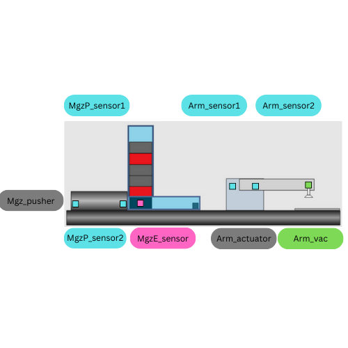
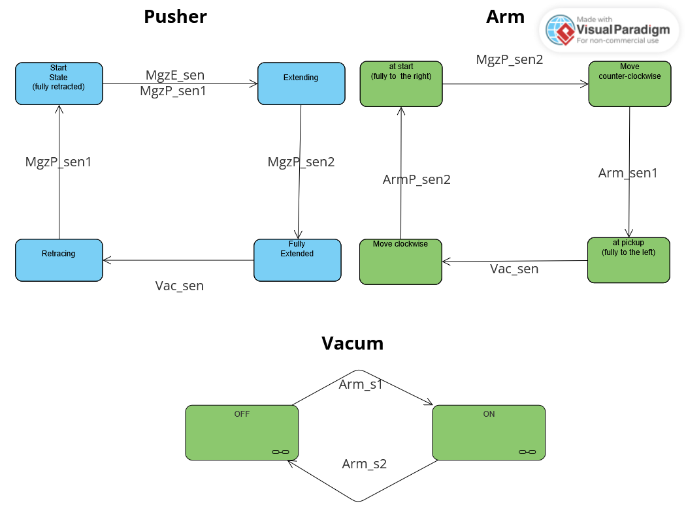
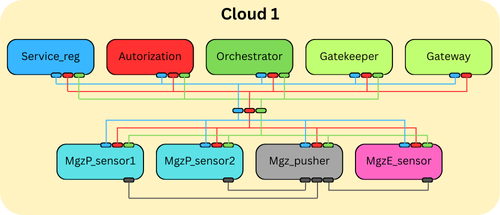
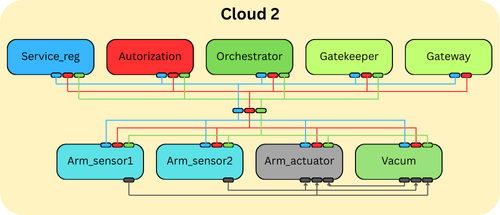

# D7042E Project
This is a school project for learning Eclipse arrowhead framework.

I used the [go sdk](https://github.com/eislab-cps/arrowhead-client-go) to implement my cloud. 

In the docker directory you can find my docker cointainer based on [Johan Kristainsson's arrowhead-core-docker](https://github.com/johankristianss/arrowhead-core-docker) repo. 
And you can find the code for each cloud in the /go/ directory.

## System description
The project is to implement factory machines the eclipse arrowhead framework.
The machines I choose are; a magazine with a piston, and a rotating arm with a vacum. 
The use case is that when there are objects in the magazine, it will push them toward the arm, and the arm will come and pick it up with the vacum, then drop it off at a conveyer.

The magazine system has 3 sensors, MgzP_sensor1, MgzP_sensor2, and MgzE_sensor. 
MgzP_sensor1, and  MgzP_sensor2 are inside the piston and will read if the piston is in the start position or the end possition. MgzE_sensor is in the magzine to check if it is empty.

The rotating arm system has 2 sensors, Arm_sensor1, Arm_sensor2.
Both of the sensors are inside the mechanical arm to track if it is in start position or the end possition.




Since I don't have acess to the physical system, or its digital twin. I will use modbus simulations to emulate the sensors. 

### Task description
When the MgzE_sensor triggers the pistion starts moving forward, pushing the object forward. 
When the piston is fully extended the mechanical arm will start moving toward the magazine. 
When the mechanical arm reaches the end possition, the vacum will turn on, picking the object up, and then it will start moving back toward the start possition. 
When it reaches the start possition the vacum will turn off and drop the object. 
The pistion will start retracting when the object has been picked up.


Here is a simple statemachine that will be the base of how the system works.



## Cloud description
They will be in 2 different local cloud and communicate with eachother.

### Cloud 1
The first cloud will have the magazine system.
All of the sensorns will be implemented as providers, and the piston will be impemented as a consumer.
The code for them can be found under /go/cloud1.



| System       | IP       | Port |
|--------------|------------|------|
| MgzP_sensor1 | localhost  | 8882 |
| MgzP_sensor2 | 172.17.0.1 | 8883 |
| MgzE_sensor  | localhost  | 8881 |
| Mgz_pusher   | 172.17.0.1 | 8880 |

### Cloud 2
The second cloud will the mechanical arm, and the vacum system.
The arm sensors will be implemented as providers, the arm actuator will be impemented as a consumer, and the vacum system will be implemented as both a provider and a consumer.
The code for them can be found under /go/cloud2.



| System       | IP         | Port |
|--------------|------------|------|
| Arm_sensor1  | localhost  | 9880 |
| Arm_sensor2  | localhost  | 9881 |
| Arm_actuator | localhost  | 9882 |
| Arm_vacuum   | 172.17.0.1 | 9883 |

These two clouds will comunicate usning a broker, Apache activemq.  

## Running the system in arrowhead
Start docker cointainers by going into the docker directory using:
```
cd docker
```
Then start the docker cointainers by running:
```
docker compose up
```

Now go to the system files by going into the /go/ directory.
```
cd /go/
```
Then choose what cloud you want to use, in this example I will use cloud 1:
```
cd cloud 1
```
### Provider
To get the providers to run we first go to the system, I will use MgzE_sensor in this example.
```
cd MgzE_sensor
```
Then set the source to the providers .env file
```
source MgzEsensor.env
```
Start the modbus simulation.
```
go run modbusSim.go
```
Start the provider.
```
go run MgzE_sensor.go
```
### Consumer
To run consumers start by going to the system.
```
cd Mgz_pusher
```
Then set its source.
```
source MgzPusher.env
```
Now run all of the states with.
```
go run .
```
## Code
I implemented this in go because I used the go sdk of arrowhead to create the clouds. 
All of the providers are a simple code that connects to a modbus client, and sets what ever that clients data to its own. 
This is supposed to mimic the sensors in a real enviorment.

The consumers where implmented with the same statemachines that is run on the systems plc.
This was a little tricky in go as statemachines are implimented a bit differently in go compared so most langues, as go don't use enums. 